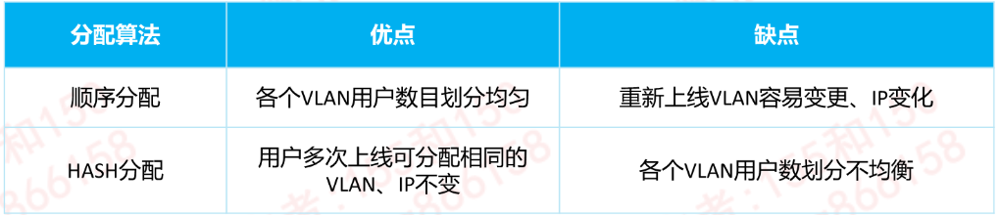
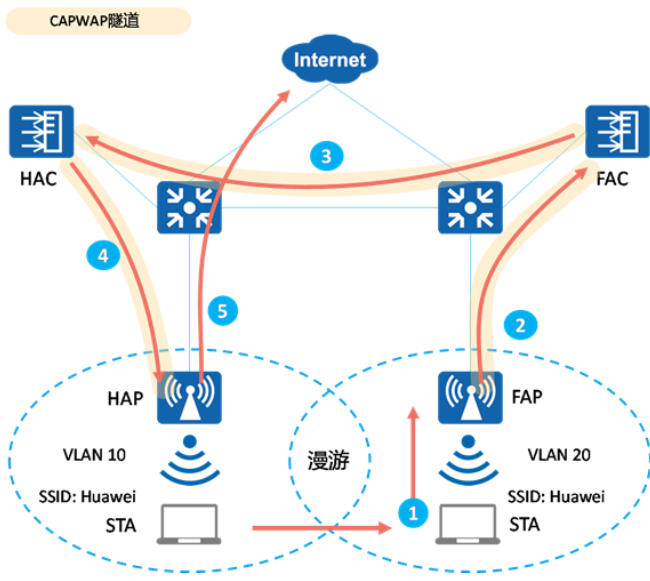
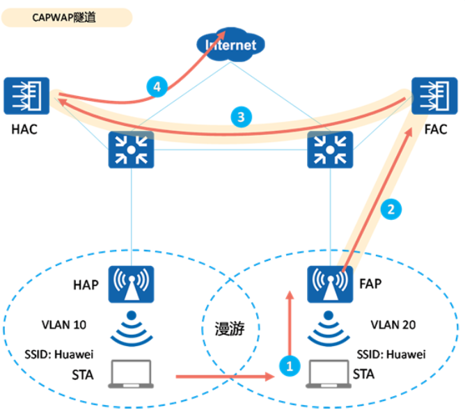

---
# HCIP-大型WLAN组网
layout: pags
title: 大型WLAN组网
date: 2025-07-10 8:24:40
tags: Network
categories: 
- [HCIP,B.1大型WLAN组网]
---

### 大型WLAN组网概述

#### 大型WLAN组的应用

让用户随时随地的接入网络        
为不同行业提供更加灵活、多样的组网方案，满足各行业对于网络应用的需求        
<!-- more -->
#### 大型WLAN组网特点

网络规模大 
- 设备型号繁杂、分布位置广且设备数量庞大。运维成本高

用户分布广
- 用户数量庞大，分布较广，网络体验要求高

接入安全要求高
- 访客、员工、合作伙伴等人员会在不定期接入到内部网络，一个秘密就能接入网络的场景不在适应

可靠性要求高
- 用户数量庞大，分布较广，网络体验要求高

#### 华为大型WLAN方案功能

设备统一管理---全网设备统一管理，配置自动备份，告警实时上报，网管不再有烦恼
接入&终端安全保障--- 准入控制技术以及终端安全防护确保安全无死角
漫游&业务随行---无缝漫游，用户在园区网络中移动时，只要身份不变，则其网络访问权限及体验将随之而动
高可靠性技术---双机冷备、双机热备、N+1备份等多种高可靠性技术保障WLAN网络稳定运行

#### 大型WLAN网络关键技术

- VLAN Pool---通过VLAN Pool把接入的用户分配到不同的VLAN，可以减少广播域，减少网络中的广播报文，提升网络性能
- DHCP Option 43 & 52
  - 当AC和AP间是三层组网时，AP通过发送广播请求报文的方式无法发现AC，这时需要通过DHCP服务器回应给AP的报文中携带的Option43字段（IPV4）或Option52（IPV6） 来通告AC的IP地址
- 漫游技术---WLAN漫游是指STA在不同AP覆盖范围之间移动且保持用户业务不中断的行为。
- 高可靠性技术---为了保证WLAN业务的稳定运行，保证在主设备故障时业务能够顺利切换到备份设备的技术
- 准入控制---准入控制技术是通过对接入网络的客户端和用户的认证来保证网络的安全，是一种“端到端”的安全技术

### VLAN Pool

1. 现有网络面临的挑战
  - 无线网络终端的移动性导致特定区域IP地址请求较多
  - 通常情况下，一个SSID只能对应一个业务VLAN，如果通过扩大子网增加IP地址则会导致广播域扩大，大量的广播报文造成网络拥塞

2. VLAN Pool概念
  - VLAN Pool是一种把多个VLAN放在一个池中并提供分配算法的VLAN分配技术，又称为VLAN池

3. VLAN Pool分配VLAN的算法
  - 顺序分配算法：把用户按上线顺序依次划分到不同的VLAN中
  - HASH分配算法：根据用户MAC地址HASH值分配VLAN

### 漫游技术

1. WLAN漫游概述
- WLAN漫游是指STA在不同AP覆盖范围之间移动且保持用户业务不中断的行为。
- 实现WLAN漫游的两个AP必须使用相同的SSID和安全模版
  - 安全模版名称可以不同，但是安全模版下的配置必须相同），认证模版的认证方式和认证参数也要配置相同
  - WLAN漫游策略主要解决以下问题
    - 避免漫游过程中的认证时间过长导致丢包甚至业务中断
    - 保证用户授权信息不变
    -  保证用户IP地址不变

2. WLAN漫游的相关术语
- HAC(Home AC):一个无线终端首次与漫游组内的某个AC进行关联，该AC即为它的HAC
- FAC(Foreign AC):一个无线终端漫游后关联的AC即为它的FAC
- HAP(Home AP):一个无线终端与漫游组内的某个AP进行关联，该AP即为它的HAP
- FAP(Foregin AP):一个无线中端漫游后关联的AP即为它的FAP

3. WLAN漫游流量转发模型
- 二层漫游直接/隧道转发
  - 由于二层漫游后STA任然在原来的子网中，所以FAP/FAC对二层漫游用户的流量转发和平台新上线的用户没有区别
  - 直接在FAP/FAC 本地在网络转发，不需要通过隧道转发回家乡代理中转
  - 漫游前
    - STA发送业务报文给HAP
    - HAP接受到业务报文后经由网关（交换机）发送给上层网络
  - 漫游后
    - STA发送业务报文给FAP
    - FAP接受到业务报文经由网关（交换机）发送给上层网络
- 三层漫游直接转发
  - HAP和HAC之间的业务报文不通过CAPWAP隧道封装，无法判定HAP和HAC是否在同一个子网内，此时需要默认报文需返回HAP进行中转
  - AC间三层漫游-直接转发（HAP为家乡代理） 

- 漫游前
  - STA发送业务报文给HAP
  - HAP接收到业务报文后直接将业务报文经过交换机发送给上层网络
- 漫游后
  - STA发送业务报文给FAP
  - FAP接收到STA发送的业务报文并通过CAPWAP隧道发送给FAC
  - FAC通过HAC和FAC之间的AC隧道将业务报文转发给HAC
  - HAC通过CAPWAP隧道将业务报文发送给HAP
  - HAP直接将业务报文发送给上层网络

- 三层漫游隧道转发
  - HAP和HAC之间的业务报文通过CAPWAP隧道封装，此时可以将HAP和HAC看作在同一个子网内，所以报文无需返回HAP，可直接通过HAC中转到上层网络
  

- 漫游前
  - STA发送业务报文给HAP
  - HAP接受到业务报文后通过CAPWAP隧道发送给HAC
  - HAC直接将业务报文经过交换机发送给上层网络
- 漫游后
  - STA发送业务报文给FAP
  - FAP接收到业务报文后通过CAPWAP隧道发送给FAC
  - FAC通过HAC和FAC之间的AC间隧道将业务报文转发给HAC
  - HAC直接将业务报文经由交换机发送给上层网络

