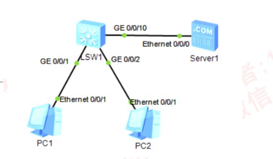
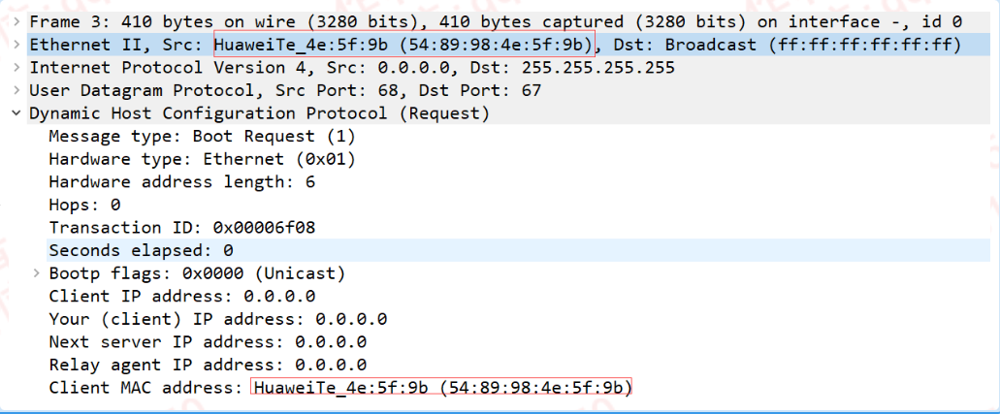
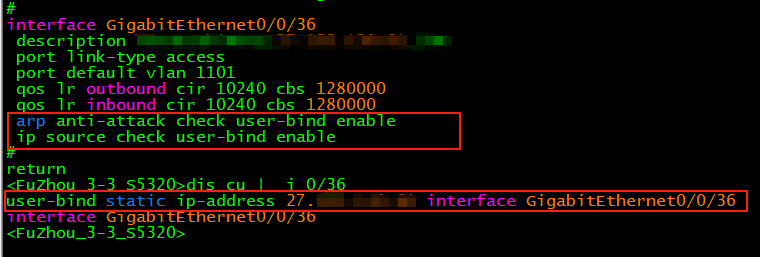
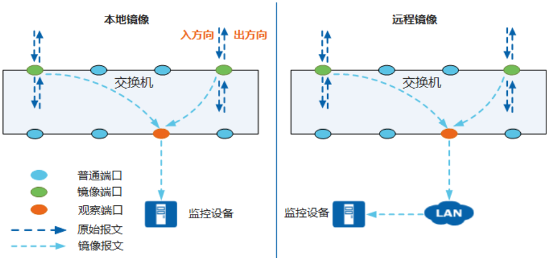
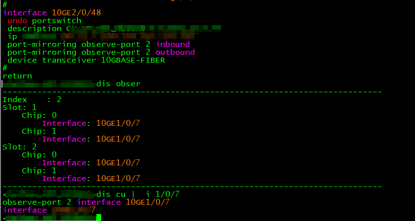
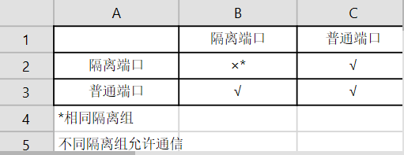

---
# HCIP-VRRP
layout: pags
title: 二层安全
date: 2025-07-08 21:24:40
tags: Network
categories: 
- [HCIP,9.1二层安全]
---

### 端口安全

1. 基本概念

- 功能
  - 限制端口学习的MAC地址数量，抵御MAC地址泛洪攻击、
  - 指定端口接收的合法MAC地址条目，抵御MAC地址欺骗攻击
- 安全MAC地址的分类
  - 安全动态MAC
    - 设备重启后表项会丢失，需要重新学习
    - 缺省情况下不会被老化，只有在配置安全MAC的老化时间后才可以被老化
    - 安全动态MAC地址的老化类型分为：绝对时间老化和相对时间老化
  - 安全静态MAC
    - 手工配置的静态MAC地址
    - 不会被老化，手动保持配置重启设备不会丢失
  - Sticky MAC
    - 使能Sticky MAC功能后转换到的MAC地址
    - 不会被老化，手动保持配置后重启设备不会丢失（注：需要保持配置）
<!-- more -->
端口安全违规

- 违规条件
  - 安全MAC地址条目达到上限
  - 收到源MAC地址不在定义的安全MAC地址条目
  - MAC地址漂移---同一个MAC地址出现在不同的端口（后学习的端口触发端口违规）

端口安全的保护作用

- restrict（默认）：过滤非法流量，产生告警
- protect：过滤非法流量，不产生告警
- shutdown：过滤非法流量，产生告警，设置接口为err-down
  - 端口默认不支持自动恢复
  - 设置端口自动恢复（推荐配置）
  - error-down auto-recovery acuse port-security interval 600s

静态MAC漂移检测功能

- 同一个MAC地址通过不同接口学到（移动用户场景），产生告警
- port-security static-flapping protect（ENSP不支持此功能）

实验

实验拓扑



实验需求
- 限制端口学习的MAC地址数量为2，含一条指定MAC地址条目
- 允许保持学习的MAC地址，若10min无流量自动清除学习的MAC地址
- 违规则禁用端口产生告警，并在10min后自动恢复
- 注：本实验ENSP功能支持不全

配置

```bash
inter g0/0/1 
    port-security enable //使能端口安全
    port-security max-mac-num 2 //设置安全MAC地址条目上限
    port-security mac-address AABB-CC00-0001 vlan 10 //指定合法的安全MAC地址条目（ENSP不支持）
    port-security mac-address sticky  //使能MAC地址粘黏
    port-security protect-action { protect | restrict | shutdown } //设置保护动作
    port-security aging-time 10min [ type { absolute | inactivity }  //设置动态MAC地址条目老化时间
    error-down auto-recovery cause port-security interval 600s  // ENSP不支持此命令  
验证配置
    dis port-security int g0/0/1    
    ENSP环境CE6800可以使用此命令，S系列不支持
```

### DHCP Snooping

基本信息
- 保障DHCP客户端从合法的DHCP服务器获取地址
- 记录DHCP客户端IP,MAC,VLAN,接口对于关系

工作原理

- DHCP Snooping端口类型
  - 信任接口---信任接口正常接收DHCP服务器响应的DHCP ACK，DHCP NAK和DHCP Offer报文
  - 非信任接口---接收到DHCP服务器响应的DHCP ACK,DHCP NAK 和DHCP Offer报文后，丢弃该白报文
- DHCP Snooping绑定表
  - 自动构建---启用Option 82
    - DHCP Discovery 穿越L2交换机，交换机添加Option 82
  - Option 82
    - 记录DHCP Client 的地理位置
    - DHCP 服务端基于此选项扩展分配DHCP客户端其他信息，实现安全控制
    - Option 82包含两个常用子选项Circuit ID 和Remote ID
    - Circuit ID 子选项主要用来标识客户端所在的VLAN 接口等信息
    - Remote ID子选项主要用来标识客户端接入的设备，一般为设备的MAC地址
  - DHCP Relay 默认启用Option 82功能，DHCP Snooping默认未启用
  - 手动创建---user-bind static ip-address 10.1.20.10 mac0address aabb-cc00-0001 interface g0/0/1 vlan 10

应用场景

1. DHCP Server 欺骗攻击     
- 实现方式：网络内假设伪造DHCP服务器
- 抵御方法：指定信任与非信任接口

2. DHCP饥饿攻击
- 实现原理：DHCP Server基于DHCP Request 包含的CHADDR（客户端硬件地址）字段已确认用户端的MAC地址
- 默认：DHCP Request 的源MAC=CHADDR
- 攻击者通过修改CHADDR字段实现饥饿攻击
- 抵御方法：限制单一接口的允许的最大DHCP用户数
  - 检查CHADDR字段与数据帧的MAC地址是否一致  



3. 非法地址释放与续租
- 实现方式：攻击者冒充合法用户不断向DHCP Server发送DHCP Request 或DHCP Release续租或释放地址
- 抵御方法：基于DHCP Snooping 绑定表检查DHCP Request 与DHCP Release对应的MAC,IP,入接口，VLAN是否匹配DHCP Snooping表项  

4. DHCP泛洪攻击
- 攻击者短时间内向设备发送大量的DHCP报文，将会对设备的性能造成巨大的冲击以至可能会导致设备无法正常工作 

DHCP Snopping配置

实验就不做了 后续讲DHCP会详细介绍

```bash
dhcp enable 
dhcp server detect // 监控网络内存在的DHCP服务器
dhcp snooping enable //全局启用DHCP Snooping
设置DHCP Snooping 告警
dhcp snooping alarm threshold 100 
配置全局DHCP Snooping 丢弃报文数量的告警阈值
缺省情况下，丢弃报文数量的告警阈值未100packets
dhcp snooping alarm dhcp-rate enable // 使能当丢弃的DHCP报文数量达到告警阈值时的告警功能
dhcp snooping alarm dhcp-rate threshold 100  //配置被丢弃的DHCP报文的告警阈值
dhcp snooping check dhcp-rate enable //使能对DHCP报文速率进行检测功能
dhcp snooping check dhcp-rate e100  //DHCP报文处理单元的最大允许速率
dhcp snooping user-bind autosave flash:/dhcp-snooping-table.tbl //使能DHCPSnooping 绑定表的本地自动备份功能 
VLAN 1
   dhcp snooping enable
   dhcp snooping check dhcp-giaddr enable //使能检测DHCP报文中GIADDR字段是否非零的功能 -GIADDR（网关IP地址）
    使用场景：DHCP报文中GIADDR字段不为零，可能导致DHCP服务器分配错误的IP地址
                防止PC用户伪造GIADDR字段不为零的DHCP报文申请IP地址，建议配置该功能
   dhcp snooping check dhcp-request enable //使能对DHCP报文进行绑定表匹配检查的功能
   dhcp snooping check dhcp-chaddr enable //使能检测DHCP Request 报文帧头MAC和DHCP数据区中CHADDR字段是否一致
   dhcp snooping cherk dhcp-rate enable //使能对DHCP报文上送DHCP报文处理单元的速率进行检测功能
   dhcp snooping max-user-number 100 //配置允许学习的DHCP Snooping 绑定表项的最大个数   
interface G0/0/1
    dhcp snooping trusted
    dhcp option82 insert enable //添加Option82选项
```

### IPSG

- 抵御IP与MAC地址欺骗
- 利用绑定表进行检查
  - 绑定表构建
    - DHCP动态构建
    - 手动创建
  - 绑定表内容
  - 基于DHCP Ack了解IP

静态配置表项



### 端口镜像

基本信息
- 镜像是指经过端口的报文复制一份到另一个指定端口
- 镜像可以在不影响设备对报文进行正常处理的情况下，将镜像端口的报文复制一份到观察口
- 网络管理员通过网络监控设备可以分析从观察口复制过来的报文，判断网络中运行的业务是否正常  

分类



镜像端口和观察端口
- 本地观察端口：与监控设备直连的端口被称为本地观察端口
- 二层远程观察端口：通过二层网络与监控设备相连的端口被称为二层远程观察端口
- 三层远程观察端口：通过三层网络与监控设备相连的端口被称为三层远程观察端口

镜像源
- 端口：将指定端口接收或发送的报文复制到观察端口，此时的镜像被称为端口镜像
- VLAN：将指定VLAN内所有活动接口接收的报文复制到观察端口，此时的镜像被称为VLAN镜像
- MAC地址：将指定VLAN内源MAC地址或目的MAC地址为指定MAC地址的报文复制到观察端口，此时的镜像被称为MAC镜像
- 报文流：将符合指定规则的报文流复制到观察端口，此时的镜像被称为流镜像

镜像方向
- 镜像方向是指将镜像指定方向的报文复制到观察端口
- 入方向：将镜像端口接收的报文复制到观察口上。此时镜像被称为入方向镜像
- 出方向：将镜像端口发送的报文复制到观察口上。此时镜像被称为出方向镜像
- 双向：将镜像端口接收和发送的报文都复制到观察端口上

配置本地镜像



- 将10G2/0/48口的双向流量镜像到10G1/0/7

远程镜像实验这里不做了，实际环境中需要分流来区分对应流量进行远程镜像

### 端口隔离

- 实现同一VLAN内端口直接的隔离
  - 默认未启用三层隔离
- 不支持跨交换机部署

访问规则



- VLAN内代理ARP
  - 使用场景：端口属于相同的VLAN，但VLAN内配置了端口隔离，端口之间需要通信


