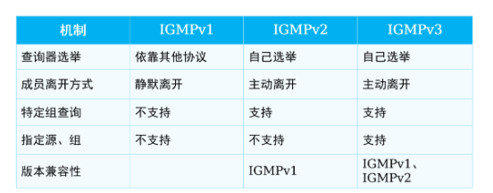

---
# HCIE-组播
layout: pags
title: 组播
date: 2025-07-15 14:29:54
tags: Network
categories: 
- [HCIE,2.1组播] 
---

### 基本概念

#### 网络传输方式

1. 单播

通信方式：一对一        
通信机制：双向通信      
数据基于目的IP转发，关注流量的去向      
技术限制
- one-to-many或many-to-many场景
- 传输效率瓶颈
- 占用发送方资源
 <!-- more -->
2. 广播

通信方式：一对所有      
技术限制
- 重复流量
- 传输范围限制
- 安全性无法保障
- 有偿性无法保障

3. 组播

技术特点
- 无重复流量—相对于组播源来说
- 节约带宽和设备资源
- 有偿性得到保障
- 适用one-to-many或many-to-many
- 基于UDP
  - 无可靠传输机制
  - 无拥塞避免机制
  - 重复传输---传输过程存在
  - 无序传输      
  
通信机制：单向通信      
组播关注流量的来源，选择离组播最近路径
- 基于逆向路径查找（RPF）实现，具体见RPF检测章节

#### 组播架构

硬件部分
- 组播源
- 第一跳路由器
- 最后一跳路由器
- 接受者

软件部分
- 组播路由协议
  - 建立与维护组播路由，建立无环数据传输路径
  - 运行在第一跳与最后一条路由器之间
- 分类
  - 域内协议
    - PIM、DMVRP、MOSPF、CBT
  - 域间协议
    - PIM-SSM/MSDP---- 其他域组播源发现
    - MP-BGP----域间组播路由传递
  - 接受者到最后一跳路由器
    - IGMP

#### 组播模型

1. ASM模型
   
- 任意组播源
  -  一个组播组地址作为一个网络服务的集合，任何源发布到该组地址的数据得到同样的服务
  -  接收者主机加入组播组以后可以接收到任意源发送到该组的数据
- 仅针对组地址提供组播分发
- 接收者关注组地址，不关注组播源

2. SSM模型

- 指定源组播
  - 接收者主机加入组播组时，可以指定只接收哪些源的数据或指定拒绝接收来自那些源的数据
  - 加入组播组后，主机只会收到指定源发送到该组的数据 
- 针对特定源和组的绑定数据流提供服务
- 接收者关注组地址，且关注组播源
- 业务场景：IGMPV3、IGMP SSM Mapping

#### 组播地址

范围
- 224.0.0.0-239.255.255.255
  - 224.0.0.0-224.0.0.255   //为路由协议预留的永久组地址
  - 224.0.1.0-231.255.255.255     //Any-Sourcd组播组地址
  - 233.0.0.0-238.255.255.255     //Any-Sourcd组播组地址
  - 232.0.0.0—232.255.255.255    //Source-Specific临时组播组地址
  - 239.0.0.0—239.255.255.255     //本地管理的Any-Source临时组播组地址

#### 组播分发树

定义：通过RPF机制与组播路由协议，组播网络可以最终形成无环、无次优且无重复包的组播转发路径，该路径可以被称为组播分发树

这里不展开说了 详情见下面PIM部分

### IGMP

定义：IGMP是TCP/IP协议族中负责IPv4组播成员管理的协议，用来在接收者主机和与其直接相邻的组播路由器之间建立和维护组播组成员关系

组播路由器与组成员间交互报文后会生成IGMP路由表项与IGMP组表项

IGMP组表项是由用户主机发送的IGMP加入报文触发创建的，用于维护组加入信息并通知组播路由协议（通常所说的为PIM协议）创建相应(*,G)表项

IGMP路由表项的作用主要是用来扩展组播路由表项的出接口。

1. IGMPv1

- 基于查询和响应机制完成组播组管理
  - 普遍组查询报文（General Query）：查询器向共享网络上所有主机和路由器发送的查询报文，用于查询哪些组播组存在成员
- 过程
  - IGMP查询器发送目的地址为224.0.0.1（表示同一网段内所有主机和路由器）的普遍组查询报文；收到该查询报文的组成员启动定时器。普遍组查询报文是周期性发送的，发送周期可以通过命令配置，缺省情况下每隔60秒发送一次。组成员1和组成员2是组播组G1的成员，则在本地启动定时器Timer-G1。缺省情况下，定时器的范围为0～10秒之间的随机值
  - 第一个定时器超时的组成员发送针对该组的报告报文
  - IGMP查询器接收到组播组成员1的报告报文后，了解到本网段内存在组播组G1的成员，则由生成IGMP组表项与（，G1）IGMP路由表项，“”代表任意组播源。网络中一旦有组播组G1的数据到达路由器，将向该网段转发。

成员关系报告报文（Report）：主机向查询器发送的报告报文，用于申请加入某个组播组或者应答查询报文
  - IGMPv1没有基于IGMP的查询器选举机制，所以需要依赖组播路由协议（PIM）进行IGMP查询器选举
  - IGMPv1将组播路由协议（PIM）选举出唯一的组播信息转发者（Assert Winner或DR）作为IGMPv1的查询器，负责该网段的组成员关系查询
  - 查询器和非查询器均能收到成员关系报告（目的地址224.0.0.1），因此均能形成IGMP路由表与IGMP组表项
  
IGMPv1组成员离组机制
- IGMPv1没有专门定义离开组消息，当组播组成员离开组播组时，将不会再对普遍组查询报文做出回应
- 当网段内不存在特定组的组成员，IGMP查询器不会收到特定组成员的报告报文，则在一定时间（缺省值为130s）后，删除特定组所对应的组播转发表项。

2. IGMPv2

改善ICMPv1的缺陷
- IGMPv2组成员加组机制与IGMPv1基本相同
- IGMPv2增加了离开组机制
- IGMPv2增加了查询器选举机制

改善组成员离开机制，IGMPv2新增了两种报文
- 成员离开报文（Leave）：成员离开组播组时主动向查询器发送的报文，用于宣告自己离开了某个组播组。成员离开报文目的地址为224.0.0.2
- 特定组查询报文（Group-Specific Query）：查询器向共享网段内指定组播组发送的查询报文，用于查询该组播组是否存在成员。特定组查询报文目的地址为所查询组播组的组地址

3. IGMPv3

对比IGMPv3
- 对IGMPv3成员关系报告报文不仅包含主机想要加入的组播组，而且包含主机想要接收来自哪些组播源的数据
- 由于同个组播组的不同成员可能希望接收来自不同源的组播，因此IGMPv3无需成员关系报告报文抑制机制
- IGMPv3没有定义专门的成员离开报文，成员离开通过特定类型的报告报文来传达。

查询报文的分类
- 普遍组查询报文（General Query）。该报文作用与IGMPv1,IGMPv2中的普遍组查询报文作用一致
- 特定组查询报文（Group-Specific Query） 。该报文作用与IGMPv2中的特定组查询报文作用一致
- 特定源组查询报文（Group-and-Source-Specific Query）。该报文用于查询该组成员是否愿意接收特定源发送的数据。特定源组查询通过在报文中携带一个或多个组播源地址来达到这一目的

成员关系报告报文
- IGMPv3成员关系报告报文除了通告组成员的加组信息外，还能通告组成员希望接收的组播源信息。通告组播源主要有两种模式
  - INCLUDE：希望接收来自特定组播源的组播流量
  - EXCLUDE：希望过滤来自特定组播源的组播流量

成员加组机制
- IGMPv3的成员关系报文能够携带组播源信息
- IGMPv3成员关系报告报文没有成员关系报告报文和报文抑制机制

成员离组机制
- IGMP查询器在收到改变源组对应关系的成员报告后，会发送特点源的查询报文，确认是否还有组成员存在

4. IGMP各版本之间的差异

5. IGMP特性

IGMP Snooping
  - 原因： 当组播数据从最后一跳路由器发往组播组成员时，往往会经过交换机。由于组播数据的目的MAC地址是组播MAC地址，默认情况下交换机将泛洪此类数据帧，有可能导致不同组的组播流量会被别组的成员接收
  - 功能：IGMP Snooping功能可以控制组播流量在以太网的泛洪范围，避免不同组的组播流量被别组成员接收
  - 原理：当主机和上游三层设备之间传递的IGMP协议报文通过二层组播设备时，IGMP Snooping分析报文携带的信息，根据这些信息建立和维护二层组播转发表，从而指导组播数据在数据链路层按需转发
  - 路由器端口形成后会启动老化计时器（默认180s）,当路由器端口收到新的普遍组查询后刷新该计时器
  - IGMP Snooping不再使用成员关系报告报文抑制机制
    - 由于IGMP Snooping需要监听IGMP报文才能决定端口角色，进而指导转发，所以所有组成员都需要发送IGMP组成员关系报告报文
    - 当IGMP Snooping设备收到成员关系报告报文后，只将成员关系报告报文从路由器接口发送出去，从而避免其余组成员收到成员关系报告报文，不触发成员关系报告报文抑制机制

IGMP SSM Mapping
  - 原因：现网中存在部分只能运行IGMPv1与IGMPv2的老旧终端，在部署SSM模式的组播时，由于IGMPv1与IGMPv2报文中无法携带组播源信息，因此无法使用SSM模式的组播网络
  - 功能：IGMP SSM Mapping通过静态的将组播源与组播组进行绑定，使得IGMPv1与IGMPv2的组成员也能接入SSM组播网络
  - 原理：在IGMP查询器上静态配置SSM地址的映射规则，将IGMPv1或IGMPv2成员关系报告中的组信息映射为源组信息
  - 当IGMP查询器收到来自成员主机的IGMPv1或IGMPv2报告报文时，首先检查该报文中所携带的组播组地址G，然后根据检查结果的不同分别进行处理
    - 如果G在ASM（Any-Source Multicast）范围内，则只提供ASM服务
    - 如果G在SSM组地址范围内（缺省情况下为232.0.0.0～232.255.255.255）
      - 如果路由器上没有G对应的SSM Mapping规则，则无法提供SSM服务，丢弃该报文
      - 如果路由器上有G对应的SSM Mapping规则，则依据规则将报告报文中所包含的(*, G)信息映射为(G, INCLUDE, (S1, S2...))信息，提供SSM服务  

IGMP Proxy

-  原因：现网中可能存在一台IGMP查询器需要管理大量组成员的情况，大量成员主机频繁加入/离开组播组时，会产生大量的IGMP成员关系报告/离开报文，从而给IGMP查询器带来较大的处理压力
- 功能：通过IGMP Proxy功能可减少IGMP查询器接收IGMP成员关系报告/离开报文的数量，减轻IGMP查询器压力
- 原理：  IGMP代理设备收到某组播组的报告报文后，会在IGMP组表项中查找该组播组：
  - 如果没有找到相应的组播组，IGMP代理设备会向接入设备发送针对该组播组的报告报文，并在组播转发表中添加该组播组；
  - 如果找到相应的组播组，IGMP代理设备就不需要向接入设备发送报告报文。

### RPF

1. 基本信息

逆向路径校验
- 使用组播源作为参考点来执行RPF校验
- 根据RPF算法寻找去往组播源“最近”的接口

基于RPF确定组播流量入接口       
基于PIM Join/Prune或IGMP Join/Leave确定组播出接口       
解决组播转发防环与防重放        
RPF检查规则
- 组播流入接口与抵达组播源的最近接口一致，则允许接收组播流

2. RPF检测规则
- 基于最长匹配---使能multiacst long-match
- 基于优先级
- 基于组播静态路由---优先级1
- 组播-BGP路由条目--优先级255
- 基于单播协议路由条目
  - 基于最小度量值
  - 若负载均衡，基于下一跳较大IP的PIM邻居

