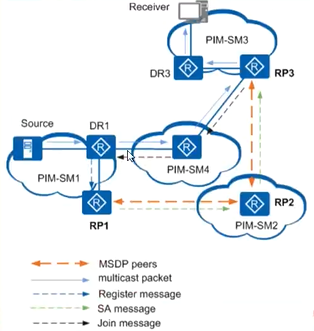

---
# HCIE-组播
layout: pags
title: 组播2
date: 2025-07-20 14:29:54
tags: Network
categories: 
- [HCIE,2.1组播2] 
---

### PIM

PIM（协议无关组播）协议主要作用是生成AS域内的组播分发树

#### PIM-DM

- 场景：用在组成员较少且相对密集的组播网络中
- 功能：建立组播分发树的基本思路是“扩散-剪枝”，即将组播流量全网扩散，然后剪枝没有组成员的路径，最终形成组播分发树
- 原理：PIM-DM在形成SPT的过程中，扩散（Flooding），剪枝（Prune）机制，邻居发现（Neighbor Discovery），嫁接（Graft），断言（Assert）和状态刷新（State Refresh）机制
-  PIM-DM使用报文主要是以下几类


- 扩散机制：组播数据包向所有的PIM邻居泛洪，同时组播路由器产生组播路由表项
- 断言机制：当组播转发过程中存在多路访问网络，则需要选举出一个组播转发路由器，避免重复组播报文
   - 获胜一方的下游接口称为Assert Winner，将负责后续对该网段组播报文的转发
   - 落败一方的下游接口称为Assert Loser，后续不会对该网段转发组播报文，PIM路由器也会将其从（S，G）表项下游接口列表中删除。
   - 选举规则
     - 单播路由协议优先级较高者获胜。
     - 如果优先级相同，则到组播源的开销较小者获胜
     - 如果以上都相同，则下游接口IP地址最大者获胜
- 剪枝机制：如果组播路由器下没有组成员，则将源到该组播路由器的组播转发路径剪枝
- 状态刷新机制：离组播源最近的第一跳路由器会周期性地触发State Refresh报文在全网内扩散
- 嫁接机制：通过IGMP了解到与其相连的用户网段上，组播组G有新的组成员加入。随后叶子路由器会基于本地的组播路由表向上游发送Graft报文，请求上游路由器恢复相应出接口转发，将其添加在（S，G）表项下游接口列表中


#### PIM-SM（稀疏模式）

场景：用在组成员较多且相对稀疏的组播网络中
- PIM-SM(ASM)：为任意组播建立组播分发树
  - 适合网络中的组成员相对比较稀疏，分布广泛的大型网络
  - 采用接收者主动加入的方式建立组播分发树，需要维护RP、构建RPT、注册组播源
- PIM-SM(SSM)：为指定组播建立组播分发树

####  PIM-SSM

基本信息
- 基于SSM模型实现提供指定源组播服务
- 实现控制用户接收指定源的组播流量
- 无需构建RPT；无需维护RP；无需PIM-DM泛洪机制
- 直接在组播源与组成员之间建立SPT

SSM策略     

如果组播源不在特定范围可以添加策略指定范围

```bash
pim 
ssm-policy <acl name>
```


### RP

#### 基本信息

- 汇聚点RP（Rendezvous）为网络中一台重要的PIM路由器，用于处理源端DR注册信息及组成员加入请求，网络中所有PIM路由器都必须知道RP的地址，类似于一个供求信息的汇聚中心
- 目前可以通过以下方式配置RP
  - 静态RP：在网络中的所有PIM路由器上配置相同的RP地址，静态指定RP的位置
  - 动态RP：通过选举机制在多个C-RP（Candidate-RP）之间选举RP
  - Anycast RP：一般为冗余考虑

#### BSR

基本信息
- 自举路由器
- Bootstrap RP
- 工业标准
- 选举角色
  - C-RP
    - 候选RP
    - 参与RP选举的路由器
  - BSR
    - BSR仅做C-RP中转者
    - BSR不提供C-RP选举判定
  - C-BSR允许成为C-PR  

#### 工作原理

C-RP选举过程
- C-BSR通过bootsrrap通告网络中存在BSR
- C-RP向BSR发送Advertisement报文（单播）
  - 通告周期60s
  - 宣告保持时间150s
  - 通告内容：C-RP地址、服务组地址、C-RP优先级  
- BSR通告bootsrrap信息到其他PIM邻居
  - bootsrrap内容：C-RP信息的汇总（RP-Set） 
- 各PIM路由器根据RP-Set,竞选RP
  - RP选举规则 
    - 基于C-RP服务的组范围掩码最长者获胜
    - 基于C-RP优先级较高者获胜
    - 比较Hash值，计算结果较大者获胜
    - 比较C-RP的IP地址较大者获胜

C-BSR选举过程

- C-BSR竞选初始阶段
  - 所有C-BSR假设本地的BSR
  - 全网通告bootstrap 
- bootstrap包含内容
  - C-BSR地址 
  - C-BSR优先级
- BSR选举有其他PIM设备基于收集的Bootstrap自行判定BSR
  - BSR选举规则--优先级、IP地址
- Bootstrap防环机制
  - 基于Bootstrap中包含的BSR地址执行RPF计算      
  - Bootstrap源地址必须为PRF邻居地址

##### 动态RP实验

实验拓扑


实验配置

基础配置略

```bash
接口应用
pim sm

R3
pim
pim c-rp lo0
#
R5
pim
pim c-rp lo0
#
R2
pim
pim c-bsr lo0
#
R4
pim
pim c-bsr lo0
##
```

验证配置

1. 验证底层环境


2. 验证组播环境


3. 验证默认选择RP，这里默认哈希算法自动选择的，可以通过调整参数配置优先级


4. 验证BSR


#### Anycast RP

技术优势

- 降低单个RP的负担
- 提供RP冗余
- 优先转发路径
- 实现组播源就近注册和接收者就近加入

2.Anycast RP 实验


配置

其他配置同动态RP，需要修改的配置如下,

```bash
R3
#
interface LoopBack1
 ip address 150.1.10.10 255.255.255.255 
 pim sm
#
pim
 c-rp LoopBack1
 anycast-rp 150.1.10.10
  local-address 150.1.3.3
  peer 150.1.5.5
#

R5
#
interface LoopBack1
 ip address 150.1.10.10 255.255.255.255 
 pim sm
#
#
pim
 c-rp LoopBack1
 anycast-rp 150.1.10.10
  local-address 150.1.5.5
  peer 150.1.3.3
#
```


### MSDP

#### 基本信息

- 组播源发现协议
- 应用场景
  - 域内部署  
    - Anycast RP 之间部署MSDP对等体，实现RP之间负载分担与冗余
  - 域间部署 
    - 不同域内的RP之间部署MSDP对等体，实现不同域之间共享组播源信息---- 基于SA（源活跃）信息交互实现
- MSDP对等体分类
  - 源端MSDP对等体
    - 距离组播源最近的RP
    - 创建SA，描述组播源注册信息
    - 只能配置在RP处
  - 接收者MSDP对等体  
    - 距离接收者最近的RP
    - 基于SA信息，建立SPT和转发组播流量
    - 只能配置在RP处
  - 中间MSAP对等体
    - 传递SA信息到其他MSDP对等体
    - 可以配置在非RP处

#### 工作原理

MSDP报文

- TLV结构
- SA通告内容
  - 源RP的地址信息
  - （S,G）条目数量统计信息 
  - （S,G）条目
  - 组播流量
- SA报文功能
  -  传递（S，G）信息
  -  封装组播流量
  -  MSDP会话维护
  
MSDP对等体建立过程


- 比较MSDP对等体IP地址
  - IP地址较小的一方发起MSDP会话建立
  - IP地址较大的一方状态为listen
  - IP地址较小的一方状态为connect 

组播源信息在域间的传递



- 组播源Source向组播组G发送数据，DR注册到RP1
  - RP1因此获知了该组播源的相关信息 
- RP1创建SA信息，向RP2发送1 、
  - SA信息中包含
    - 组播源的地址、组播组的地址以及创建该SA信息的源端RP
- PR2接收到该SA消息后，执行RP检查。检查通过，向RP3转发
  - 同时检查本域内是否存在组G成员
- PR3接收到该SA消息后，执行RPF检查，检查通过
  - 由于PIM-SM3域内存在组G成员，会通过IGMP协议在RP3上生成（*，G）
- RP3创建（S,G）表项，向组播源发送（S,G）加入报文，创建SPT  

-----------------------------------------------------------------------------------------------------------------