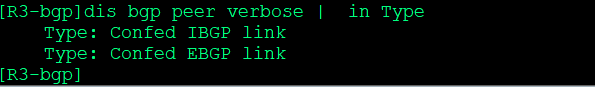

---
# HCIP-BGP
layout: pags
title: 路由反射器与联盟实验
date: 2025-07-02 12:29:54
tags: Network
categories: 
- [HCIP,4.2BGP路径属性] 
---

### 路由反射器与联盟实验

- 实验拓扑


 <!-- more -->
- 配置

为了实验方便 通过ISIS实现路由传递

```bash
R1
    isis
        net 49.0000.0000.0000.0001.00
        is-level level-2
    interface g0/0/0 
        ip add 155.1.12.1 24
        isis enable
    interface Lo0
        ip add 150.1.1.1 32
        isis enable
R2
    isis 
        net 49.0000.0000.0000.0002.00
        is-level level-2 
    interface g0/0/0 
        ip add 155.1.12.2 24
        isis enable
    interface g0/0/1 
        ip add 155.1.23.2 24
        isis enable
    interface Lo0
        ip add 150.1.2.2 32
        isis enable
R3
    isis 
        net 49.0000.0000.0000.0003.00
        is-level level-2
    interface g0/0/1
        ip add 155.1.23.3 24
        isis enable
    interface g0/0/0 
        ip add 155.1.34.3 24
        isis enable
    interface Lo0
        ip add 150.1.3.3 24
        isis enable          
R1 
    bgp  65123
        confederation id 100
        peer 150.1.2.2  as-number 65123
        peer 150.1.2.2 connect-interface LoopBack0
        ipv4-family unicast 
            undo synchronization
            peer 150.1.2.2 enable
R2
    bgp 65123 
        confederation id 100
        peer 150.1.1.1  as-number 65123
        peer 150.1.3.3  as-number 65123
        ipv4-family unicast
            undo synchronization 
            peer 150.1.1.1 enable
            peer 150.1.1.1. reflect-client
            peer 150.1.3.3 enable
            peer 150.1.3.3 reflect-client
R3
    bgp 65123
        confederation id 100 
        confedration peer-as 65004
        peer 150.1.2.2 as-number 65123
        peer 150.1.2.2 connect-interface LoopBack0
        peer 155.1.34.4 as-number 65004
        ipv4-family unicast 
            undo synchronization
            peer 150.1.2.2 enable
            peer 150.1.2.2 nexct-hop-local
            peer 155.1.34.4 enable
R4
    bgp 65004
        confederation id 100 
        confedration peer-as 65123
        peer 155.1.34.3 as-number 65123
        ipv4-family unicast 
            undo synchronization
            network 150.1.4.4 255.255.255.255
            peer 155.1.34.3 enable
```

- 验证配置

查看cluster-liat与originator ID


查看联盟BGP邻居关系



查看联盟AS号


