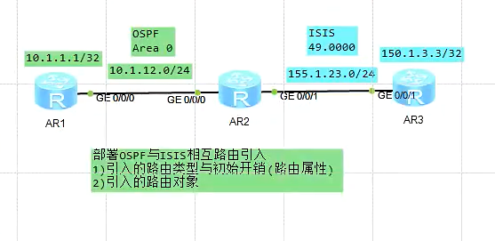
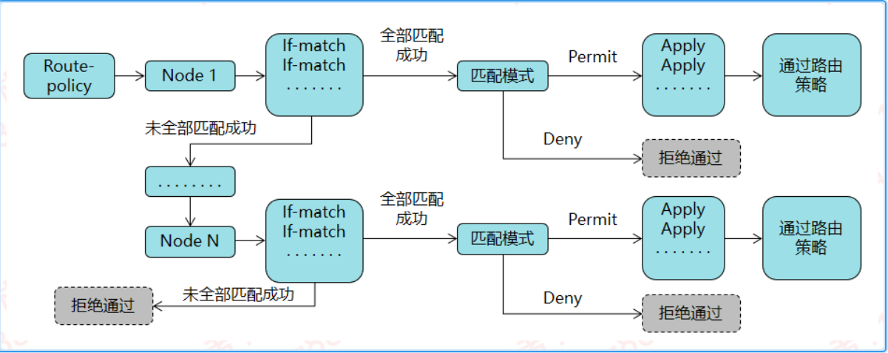
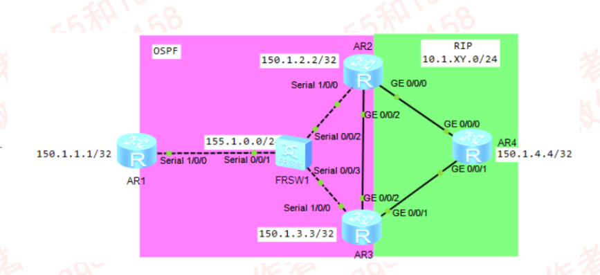
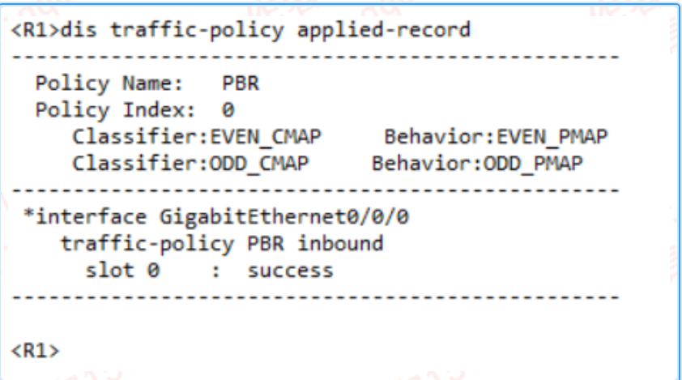

---
# HCIP-ISIS
layout: pags
title: 路由控制
date: 2025-06-30 12:29:54
tags: Network
categories: 
- [HCIP,3.1路由控制] 
---

### 路由基础

- 背景
   - 涉及不同进程或不同路由协议之间相互传递路由
   - 引入路由的设备称为ASBR（自制系统边界路由器）
   - 部署OSPF与ISIS相互路由引入
  

   <!-- more -->
- 引入的路由类型与初始开销（路由属性）
- 引入的路由对象---X->(OSPF->ISIS)
- 引入的设备：ASBR
- ASBR标记为X(OSPF)的前缀会被引入到（Y）ISIS
- ASBR上加上到X（OSPF）的接口对应前缀会被引入到(Y)ISIS
- ASBR无法引入缺省到其他路由协议
  
| X->ISIS默认设置 | X->OSPF默认设置 | X->RIP默认设置 |    X->BGP             |
|:--------------:|:--------------:|:--------------:|:---------------------:|
| 初始开销：64    |  初始开销：1    | 初始开销：1     | 初始开销：继承开销到MED |
| 路由类型：L2    |路由类型：Type 2 |优先级：100      | 优先级：255            |
|优先级：15       |优先级：150     |                | OSPF->BGP无OSPF路由类型限制|

### 路由选取

#### 标准ACL

1. 仅支持前缀匹配，不支持掩码匹配
2. 未匹配ACL条目默认抓取为空
3. 隐含条目deny
4. 案例

```bash
acl 2000
    rule permit 10.1.0.0 0.0.3.255
        包含10.1.0000 00|01.0
        10.1.0.X
        10.1.1.X
        10.1.2.X
        10.1.3.X
    rule permit 10.1.0.0 0.0.254.255
```

#### 前缀列表

1. 支持匹配前缀与前缀长度
2. 未匹配前缀列表默认抓取为空
3. 隐含条目为deny
4. 仅支持联系匹配，不支持奇偶匹配
5. 控制层面工具，不支持数据包过滤
6. 配置

```bash
    ip ip-prefix TEST index 10 premit 10.0.0.0 24
    匹配项：24   掩码长度：24   10.0.0.0/24 
    ip ip-prefix TEST index 10 premit 10.1.1.0 24 greater-equal 26
    匹配项=24  26≤匹配前缀掩码长度≤32    10.1.1.0/26-32
    ip ip-prefix TEST index 10 permit 10.1.1.0/24 gr 26 le 28
    匹配项=X   Y≤匹配前缀长度≤Z  10.1.1.0/26~28
    ip ip-prefix TEST index 10 premit 0.0.0.0
    匹配缺省路由
    ip ip-prefix TEST index 10 premit  0.0.0.0 less-equal 32
    匹配所有前缀
    ip-prefix TEST index 10 premit 0.0.0.0 gr 32
    匹配主机路由
```

#### Route-Policy

1. 支持路由过滤或路由属性修改
2. 匹配条件丰富---前缀列表，ACL,度量值，tag等
3. 工作原理



#### 仅BGP支持

- as-path-list（限BGP使用）
- community-list （限BGP使用）

请查看BGP文档

### 路由过滤

#### 静默接口

1. RIP禁用组播更新，允许单播更新---接口不再发送RIP更新，接口可以接收更新
2. OSPF，ISIS禁用邻居发现
3. BGP不支持
4. 配置
```bash
 RIP/OSPF 1 /ISIS 
    silent-interface g0/0/0 
```

#### RIP路由过滤

1. Filter-policy acl  
   使用ACL仅允许发送第三位为偶数的前缀      

```bash
acl name TEST 2000
    rule 5 premit source 10.1.0.0 0.0.254.255
rip 1 
    filter-policy acl-name TEST export
```

2. Filter-policy  prefix
    使用前缀列表实现R1仅通告掩码为25或26的前缀      

```bash
ip ip-prefix TEST  index 10 premit 10.1.0.0 16 gr 25 le 26
rip 1
    filter-policy ip-prefix TEST export
```

#### OSPF路由过滤
1. filter-policy ip-prefix/acl 
   1. 支持路由条目接收或发送过滤
   2. 支持OSPF路由表加载过滤
   3. 不支持LSA1,2过滤，支持过滤LSA3,LSA5
   4. import用于过滤路由，export用于过滤LSA5（ASBR部署）
   5. 过滤前缀掩码在25-26范围的前缀

```bash
ospf 1
    filter-policy ip-prefix TEST import
ip ip-prefix TEST index 10 deny 0.0.0.0 0 ge 25 le 26
ip ip-prefix TEST index 20 premit 0.0.0.0 0 le 32
```

- 过滤10.1.X.0第三位为奇数的前缀
  
```bash
acl name TEST 2000
    rule 5 deny source 10.1.1.0 0.0.254.255
    rule 10 premit
ospf 1
    file-policy acl-name TEST import
```

- 接口部署Filter-lsa-out

```bash
 interface g0/0/0
    ospf filter-lsa-out   all/ase/nssa/summary
```

- filter-policy route-policy        
使用route-policy支持的属性做路由筛选        
使用filter-policy过滤cost为16的前缀     

```bash
route-policy TEST deny node 10
    if-match cost 16
route-policy TEST permit node 20
ospf 1
    filter-policy route-policy TEST import
```

2. filter       
   支持协调ACL，前缀列表，route-policy使用      
   部署位置：ABR        
   仅支持过滤LSA3       
   export限制LSA离开指定区域        
   import限制LSA进入指定区域        
   使用filter过滤10.1.2.0/27与10.1.3.0/28       
```bash
acl name TEST 2000
    rule 5 premit source 10.1.0.0 0.0.1.255
ospf 1 router-id 150.1.2.2
    area 1
filter acl-name TEST export
```

### 策略路由

#### 基本信息

策略路由PBR是一种依据用户制定的策略进行路由选择的机制       
策略路由基于报文属性（源目地址、报文长度等参数）自定义转发路径      
技术优势    
- 强路由选择的灵活性和可控性
- 提供链路的利于效率   

分类
- 本地策略路由---本地策略路由仅对本机下发的报文进行处理，对转发的报文不起作用
- 接口策略路由---接口策略路由只对转发的报文起作用，对本地下发的报文（比如本地的ping报文）不起作用
- 智能策略路由

实验拓扑



基于接口

```bash
定义流量分类
 acl name EVEN 3001
    rule 5 permit ip source 10.1.1.1 0.0.0.254
acl name ODD 3002
    rule 5 permit ip source 10.1.1.0 0.0.0.254
traffic classifier ODD_CMAP operator or
    if-match acl ODD
traffic classifier EVEN_CMAP operator or
    if-match acl EVEN
定义流量行为
traffic behavior ODD_PMAP
    redirect ip-nexthop 155.1.13.3 track nqa admin TEST_R3
    redirect back-next-hop 155.1.12.2（ENSP不支持）
traffic behavior EVEN_PMAP
    redirect ip-nexthop 155.1.12.2 track nqa admin TEST_R2
    redirect back-next-hop 155.1.13.3
关联流量与行为
    traffic policy PBR
        classifier EVEN_CMAP behavior EVEN_PMAP
        classifier ODD_CMAP behavior ODD_PMAP
应用
    interface G0/0/0 
        ip address 10.1.1.1 255.255.255.0
        traffic-policy PBR inbound
NAT配置
        interface G0/0/1 
            ip address 155.1.12.1 255.255.255.0
            nat outbound 2000
        interface G0/0/2 
            ip address 155.1.13.1 255.255.255.0
            nat outbound 2000
        acl name PAT 2000
            rule 5 permit source 10.1.0.0 0.0.255.255
```

验证配置        



PBR旁路配置     

```bash
acl name BYPASS_ACL 3000
    rule 3 permit ip source 10.1.0.0 0.0.255.255 destination 10.1.0.0 0.0.255.255
traffic classifier BYPASS_CMAP openator
    if-match acl BYPASS_PMAP
traffic policy PBR
    classifier BYPASS_CMAP behavior BYPASS_PMAP
    classifier ODD_CMAP behavior ODD_PMAP 
    classifier EVEN_CMAP behavior EVEN_PMAP
```

基于本地        

```bash
policy-based-route LOCAL_PBR permit node 10
    if-match packet-length 100 200
    apply ip-address next-hop 155.1.12.2
policy-based-route LOCAL_PBR permit node 20
    if-match packet-length 201 300
    apply ip-address next-hop 155.1.13.3
ip local policy-based-route LOCAL_PBR
```

策略路由与明细路由以及缺省路由的关系        
1. 策略中不包含default参数指定的下一跳
2. 明细路由
3. 策略路由中包含的default参数指定的下一跳
4. 本地缺省路由


