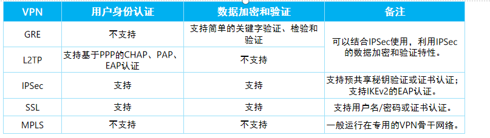

---
# HCIP-防火墙
layout: pags
title: 防火墙基础及VPN配置
date: 2025-07-15 21:24:40
tags: Network
categories: 
- [HCIP,D.1防火墙及VPN配置]
---

### 防火墙基本概念

#### 防火墙所有实验均已命令行方式部署，一般生产环境中用图形化方式，数通中只讲解防火墙基本知识，进阶看网络安全文档

防火墙发展历程和介绍

- 路由器和交换机构建了互联互通的网络，带来便利的同时也带来了安全隐患
- 例如在网络边界，企业有了如下安全诉求：
  - 外部网络安全隔离
  - 内部网络安全管控
  - 内容安全过滤
  - 入侵防御
  - 防病毒
<!-- more -->
防火墙与交换机、路由器功能对比
- 以园区网为例，交换机作用是接入终端和汇聚内部路由，组建内部互联互通的局域网
- 路由器作用是路由的分发、寻址和转发，构建外部连接网络
- 防火墙作用是流量控制和安全防护，区分和隔离不同安全区域

防火墙与路由器转发流程对比

防火墙的转发流程比路由器复杂。以框式设备为例，硬件上除了接口、LPU（Line Processing Unit）、交换网板等外，防火墙还特有SPU（Service Processing Unit），用于实现防火墙的安全功能

发展历程
- 防火墙从包过滤防火墙发展起经历了状态检测、统一威胁管理、NGFW等到AI防火墙，有以下特点
  -  访问控制越来越精细
  -  防护能力越来越强
  -  性能越来越高

包过滤防火墙
- 包过滤是指基于五元组对每个数据包进行检测，根据配置的安全策略转发或丢弃数据包
- 包过滤防火墙的基本原理是：通过配置访问控制列表（Access Control List，ACL）实施数据包的过滤

包过滤防火墙的缺点主要表现以下几点：
- 随着ACL复杂度和长度的增加，其过滤性能呈指数下降；
- 静态的ACL规则难以适应动态的安全要求
- 包过滤不检查会话状态也不分析数据，这很容易让黑客蒙混过关。例如，攻击者可以使用假冒地址进行欺骗，通过把自己主机IP地址设成一个合法主机IP地址，就能很轻易地通过报文过滤器

状态检测防火墙

- 状态检测是包过滤技术的发展，它考虑报文前后的关联性，检测的是连接状态而非单个报文
- 状态检测防火墙就是支持状态检测功能的防火墙

#### 防火墙基本概念

1. 安全区域
   - 安全区域（Security Zone），简称为区域（Zone），是防火墙的重要概念。防火墙大部分的安全策略都基于安全区域实施
   - 一个安全区域是防火墙若干接口所连网络的集合，一个区域内的用户具有相同的安全属性

2. 默认安全区域
   - 华为防火墙确认已创建四个区域，untrust、dmz、trust和local区域。安全区域有以下特性：
     - 默认的安全区域不能删除，也不允许修改安全优先级
     - 每个Zone都必须设置一个安全优先级（Priority），值越大，则Zone的安全优先级越高。
     - 用户可根据自己的需求创建自定义的Zone 

- 非受信区域（untrust）：通常用于定义Internet等不安全的网络
- 非军事化区域（dmz）：通常用于定义内网服务器所在区域。因为这种设备虽然部署在内网，但是经常需要被外网访问，存在较大安全隐患，同时一般又不允许其主动访问外网，所以将其部署一个优先级比trust低，但是比untrust高的安全区域中  
  - DMZ（Demilitarized Zone）起源于军方，是介于严格的军事管制区和松散的公共区域之间的一种有着部分管制的区域。防火墙设备引用了这一术语，指代一个逻辑上和物理上都与内部网络和外部网络分离的安全区域
  - DMZ安全区域很好地解决了服务器的放置问题。该安全区域可以放置需要对外提供网络服务的设备，如WWW服务器、FTP服务器等。上述服务器如果放置于内部网络，外部恶意用户则有可能利用某些服务的安全漏洞攻击内部网络；如果放置于外部网络，则无法保障它们的安全
- 受信区域（trust）：通常用于定义内网终端用户所在区域。
- 本地区域（local）：local区域定义的是设备本身，包括设备的各接口本身。凡是由设备构造并主动发出的报文均可认为是从Local区域中发出，凡是需要设备响应并处理（而不仅是检测或直接转发）的报文均可认为是由local区域接收。用户不能改变local区域本身的任何配置，包括向其中添加接口
  - 由于local区域的特殊性，在很多需要设备本身进行报文收发的应用中，需要开放对端所在安全区域与local区域之间的安全策略

3. 安全区域
- 安全策略是控制防火墙对流量转发以及对流量进行内容安全一体化检测的策略
- 当防火墙收到流量后，对流量的属性（五元组、用户、时间段等）进行识别，然后与安全策略的条件进行匹配。如果条件匹配，则此流量被执行对应的动作

4. 安全策略组成
- 安全策略的组成有匹配条件、动作和安全配置文件（可选）。安全配置文件实现内容安全
- 安全策略动作如果为“允许”则可配置安全配置文件，如果为“禁止”则可配置反馈报文

动作说明：
- 允许：如果动作为“允许”，则对流量进行如下处理
  - 如果没有配置内容安全检测，则允许流量通过
  - 如果配置内容安全检测，最终根据内容安全检测的结论来判断是否对流量进行放行。内容安全检测包括反病毒、入侵防御等，它是通过在安全策略中引用安全配置文件实现的。如果其中一个安全配置文件阻断该流量，则防火墙阻断该流量。如果所有的安全配置文件都允许该流量转发，则防火墙允许该流量转发
- 禁止：表示拒绝符合条件的流量通过
  - 如果动作为“禁止”，防火墙不仅可以将报文丢弃，还可以针对不同的报文类型选择发送对应的反馈报文。发起连接请求的客户端/服务器收到防火墙发送的阻断报文后，可以快速结束会话并让用户感知到请求被阻断
    - Reset客户端：防火墙向TCP客户端发送TCP reset报文
    - Reset服务器：防火墙向TCP服务器发送TCP reset报文
    - ICMP不可达：FW向报文客户端发送ICMP不可达报文

安全策略的匹配过程  

- 当配置多条安全策略规则时，安全策略的匹配按照策略列表的顺序执行，即从策略列表顶端开始逐条向下匹配。如果流量匹配了某个安全策略，将不再进行下一个策略的匹配
- 安全策略的配置顺序很重要，需要先配置条件精确的策略，再配置宽泛的策略

#### 会话表

- 安全策略的配置顺序很重要，需要先配置条件精确的策略，再配置宽泛的策略
- 防火墙采用了基于“状态”的报文控制机制：只对首包或者少量报文进行检测就确定一条连接的状态，大量报文直接根据所属连接的状态进行控制。这种状态检测机制迅速提高了防火墙的检测和转发效率。会话表就是为了记录连接的状态而存在的。设备在转发TCP、UDP和ICMP报文时都需要查询会话表，来判断该报文所属的连接并采取相应的处理措施

防火墙基本配置实验

 

多协议通道 如FTP协议 IA也讲过 可查阅对应文档

FTP 两种协议端口 1. 控制通道 2. 协议通道

端口有两个随机数（P1*256+P2） 根据5元组来制定策略实现不了通讯，所以出现了对应的ASPT功能 

- 实验配置就不贴了 实际环境中建议用web配置，只要沟选上就行
  
  

### VPN

#### 出现背景

- 在VPN出现之前，企业分支之间的数据传输只能依靠现有物理网络，由于Internet中存在多种不安全因素，报文容易被网络中的黑客窃取或篡改，最终造成数据泄密、重要数据破坏等后果
- 除了通过Internet，还可以通过搭建一条物理专线链接保证数据的安全传输，但其费用会非常昂贵，且专网的搭建和维护十分困难

VPN简介
- VPN即虚拟专用网，泛指通过VPN技术在公用网络上构建的虚拟专用网络。VPN用户在此虚拟网络中传输私网流量，在不改变网络现状的情况下实现安全、可靠的连接

#### VPN对应的网络层次

实验只做GRE VPN 和IPsec VPN ,其他两种原理差不多，

VPN关键技术
- VPN技术的基本原理是利用隧道（Tunnel）技术，对传输报文进行封装，利用VPN骨干网建立专用数据传输通道，实现报文的安全传输。
- 位于隧道两端的VPN网关，通过对原始报文的“封装”和“解封装”，建立一个点到点的虚拟通信隧道
  - 隧道的功能就是在两个网络节点之间提供一条通路，使数据能够在这个通路上透明传输。VPN隧道一般是指在VPN骨干网的VPN节点之间建立的用来传输VPN数据的虚拟连接。隧道是构建VPN不可或缺的部分，用于把VPN数据从一个VPN节点透明传送到另一个上
  - 隧道通过隧道协议实现。目前已存在不少隧道协议，如GRE（Generic Routing Encapsulation）、L2TP（Layer 2 Tunneling Protocol）等。隧道协议通过在隧道的一端给数据加上隧道协议头，即进行封装，使这些被封装的数据能都在某网络中传输，并且在隧道的另一端去掉该数据携带的隧道协议头，即进行解封装。报文在隧道中传输前后都要通过封装和解封装两个过程
  - 部分隧道可以混合使用，如GRE Over IPSec隧道

身份认证、数据加密
- 身份认证、数据加密和认证技术可以有效保证VPN网络与数据的安全性：
  - 身份认证：可用于部署了远程接入VPN的场景，VPN网关对用户的身份进行认证，保证接入网络的都是合法用户而非恶意用户。也可以用于VPN网关之间对对方身份的认证。
  - 数据加密：将明文通过加密变成密文，使得数据即使被黑客截获，黑客也无法获取其中的信息
  - 数据验证：通过数据验证技术对报文的完整性和真伪进行检查，丢弃被伪造和被篡改的报文
 

#### IPsec

IPSec（IP Security） VPN一般部署在企业出口设备之间，通过加密与验证等方式，实现了数据来源验证、数据加密、数据完整性保证和抗重放等功能
- 数据来源验证：接收方验证发送方身份是否合法
- 数据加密：发送方对数据进行加密，以密文的形式在Internet上传送，接收方对接收的加密数据进行解密后处理或直接转发
- 数据完整性：接收方对接收的数据进行验证，以判定报文是否被篡改
- 抗重放：接收方拒绝旧的或重复的数据包，防止恶意用户通过重复发送捕获到的数据包所进行的攻击

IPSec协议体系

IPSec不是一个单独的协议，它给出了IP网络上数据安全的一整套体系结构，包括AH（Authentication Header）、ESP（Encapsulating Security Payload）、IKE（Internet Key Exchange）等协议

- 一般用划红框的部分
- IPSec使用认证头AH（Authentication Header）和封装安全载荷ESP（Encapsulating Security Payload）两种安全协议来传输和封装数据，提供认证或加密等安全服务
  - AH和ESP协议提供的安全功能依赖于协议采用的验证、加密算法。
  - AH仅支持认证功能，不支持加密功能。ESP支持认证和加密功能
  - 安全协议提供认证或加密等安全服务需要有秘钥的存在
- 秘钥交换的方式有两种：
  - 带外共享密钥：在发送、接收设备上手工配置静态的加密、验证密钥。双方通过带外共享的方式（例如通过电话或邮件方式）保证密钥一致性。这种方式的缺点是可扩展性差，在点到多点组网中配置密钥的工作量成倍增加。另外，为提升网络安全性需要周期性修改密钥，这种方式下也很难实施
  - 通过IKE协议自动协商密钥：IKE建立在Internet安全联盟和密钥管理协议ISAKMP定义的框架上，采用DH（Diffie-Hellman）算法在不安全的网络上安全地分发密钥。这种方式配置简单，可扩展性好，特别是在大型动态的网络环境下此优点更加突出。同时，通信双方通过交换密钥交换材料来计算共享的密钥，即使第三方截获了双方用于计算密钥的所有交换数据，也无法计算出真正的密钥

题外话

密钥分为两种：一种是对称密钥，一种是非对称密钥，这里的IPsec采用的是对称密钥，设备两端都需要配置，密钥详细介绍可以查看Linux文档

IPSec基本原理
- IPSec隧道建立过程中需要协商IPSec SA（Security Association，安全联盟），IPSec SA一般通过IKE协商生成
  - SA由一个三元组来唯一标识，这个三元组包括安全参数索引SPI（Security Parameter Index）、目的IP地址和使用的安全协议号（AH或ESP）。其中，SPI是为唯一标识SA而生成的一个32位比特的数值，它在AH和ESP头中传输。在手工配置SA时，需要手工指定SPI的取值。使用IKE协商产生SA时，SPI将随机生成
  - SA是单向的逻辑连接，因此两个IPSec对等体之间的双向通信，最少需要建立两个SA来分别对两个方向的数据流进行安全保护。
  - IKE作为秘钥协商协议，存在两个版本：IKEv1和IKEv2，这里采用IKEv1为例进行介绍，IKEv2可查阅对应的产品文档
    - IKEv1协商阶段1的目的是建立IKE SA。IKE SA建立后对等体间的所有ISAKMP消息都将通过加密和验证，这条安全通道可以保证IKEv1第二阶段的协商能够安全进行。IKE SA是一个双向的逻辑连接，两个IPSec对等体间只建立一个IKE SA
    - IKEv1协商阶段2的目的就是建立用来安全传输数据的IPSec SA，并为数据传输衍生出密钥。该阶段使用IKEv1协商阶段1中生成的密钥对ISAKMP消息的完整性和身份进行验证，并对ISAKMP消息进行加密，故保证了交换的安全性
  - IKE协商成功意味着双向的IPSec隧道已经建立，可以通过ACL方式或者安全框架方式定义IPSec“感兴趣流”，符合感兴趣流流量特征的数据都将被送入IPSec隧道进行处理。
    - 感兴趣流：需要被IPSec保护的数据流

#### GRE

通用路由封装协议（General Routing Encapsulation，GRE）是一种三层VPN封装技术。GRE可以对某些网络层协议（如IPX、IPv4、IPv6等）的报文进行封装，使封装后的报文能够在另一种网络中（如IPv4）传输，从而解决了跨越异种网络的报文传输问题

GRE还具备封装组播报文的能力。由于动态路由协议中会使用组播报文，因此更多时候GRE会在需要传递组播路由数据的场景中被用到，这也是GRE被称为通用路由封装协议的原因

GRE基本原理
- GRE构成要素分为3个部分：乘客协议、封装协议和运输协议
  - 乘客协议是指用户在传输数据时所使用的原始网络协议
  - 封装协议的作用就是用来“包装”乘客协议对应的报文，使原始报文能够在新的网络中传输
  - 运输协议是指被封装以后的报文在新网络中传输时所使用的网络协议

- 隧道接口（Tunnel Interface）是为实现报文的封装而提供的一种点对点类型的虚拟接口，与Loopback接口类似，都是一种逻辑接口
- 如图所示，乘客协议为IPv6，封装协议为GRE，运输协议为IPv4。整体转发流程如下
  - 当R1收到IP1发来的IPv6数据包，查询设备路由表，发现出接口是隧道接口，则将此报文发给隧道接口处理
  - 隧道接口给原始报文添加GRE头部，然后根据配置信息，给报文加上IP头。该IP头的源地址就是隧道源地址，IP头的目的地址就是隧道目的地址
  - 封装后的报文在IPv4网络中进行普通的IPv4路由转发，最终到达目的地R2
  - 解封装过程和封装过程相反，这里不再赘述

GRE Over IPSec

- GRE的主要缺点是不支持加密和认证，数据的安全传输得不到很好的保障。
- IPSec的主要缺点是只支持IP协议，且不支持组播
- 可通过部署GRE Over IPSec结合两种VPN技术的优点

#### L2TP
- L2TP是虚拟私有拨号网VPDN（Virtual Private Dial-up Network）隧道协议的一种，它扩展了点到点协议PPP的应用，是一种在远程办公场景中为出差员工或企业分支远程访问企业内网资源提供接入服务的VPN
- L2TP组网架构中包括LAC（L2TP Access Concentrator，L2TP访问集中器）和LNS（L2TP Network Server，L2TP网络服务器）

L2TP消息
- L2TP协议包含两种类型的消息，控制消息和数据消息，消息的传输在LAC和LNS之间进行
  - 控制消息
    - 用于L2TP隧道和会话连接的建立、维护和拆除。在控制消息的传输过程中，使用消息丢失重传和定时检测隧道连通性等机制来保证控制消息传输的可靠性，支持对控制消息的流量控制和拥塞控制
    - 控制消息承载在L2TP控制通道上，控制通道实现了控制消息的可靠传输，将控制消息封装在L2TP报头内，再经过IP网络传输。
  - 数据消息
    - 用于封装PPP数据帧并在隧道上传输。数据消息是不可靠的传输，不重传丢失的数据报文，不支持对数据消息的流量控制和拥塞控制
    - 数据消息携带PPP帧承载在不可靠的数据通道上，对PPP帧进行L2TP封装，再经过IP网络传输

#### MPLS VPN概述

MPLS是一种利用标签（Label）进行转发的技术，最初为了提高IP报文转发速率而被提出，现主要应用于VPN和流量工程、QoS等场景

在IE的MPLS文档中会有这个实验 这里就不过多讲解了

后面有些实验就不贴基础互联配置了 对应基础不是很好的同学先看下之前的文档

#### GRE实验

- 扩展一下
  - 如果VPN 封装的对象是数据帧，则该VPN是二层VPN
  - 如果VPN 封装的对象是数据包，则该VPN是三层VPN
  - 如果VPN 封装的对象是应用层数据，则该VPN是应用层VPN

#### IPSec

- 图中只贴了F1的配置 F2同理

#### GRE Over IPSec

- 图中只贴了策略配置 其他配置见上面IPSEC和GRE实验

一般配置还是建议用web来实现，排查故障建议使用命令行方式

通过查看会话表来确认故障点位---dis firew sess tab

VRF---VPN实例

这个技术比较简单 IE中会和MPLS VPN实验中联合使用 用来隔离路由表的 这里就只贴一张图了，用来隔离路由表的

---------------------------------------------------------------------------------------------------------

