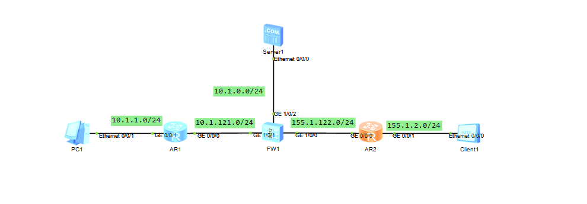
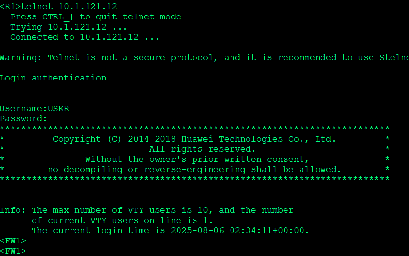
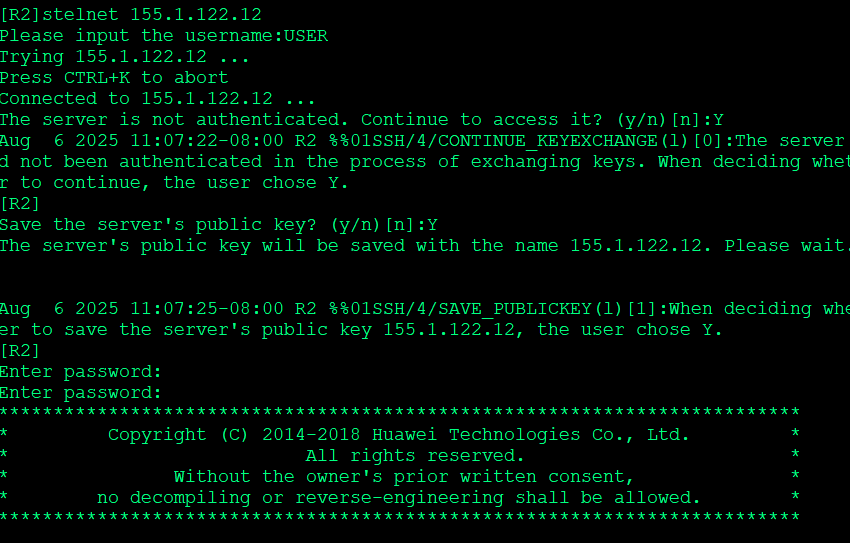
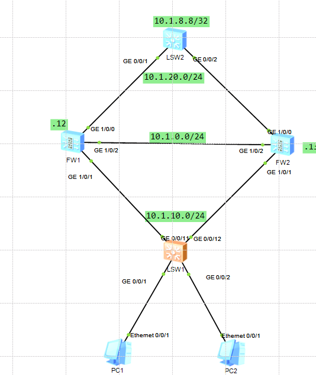
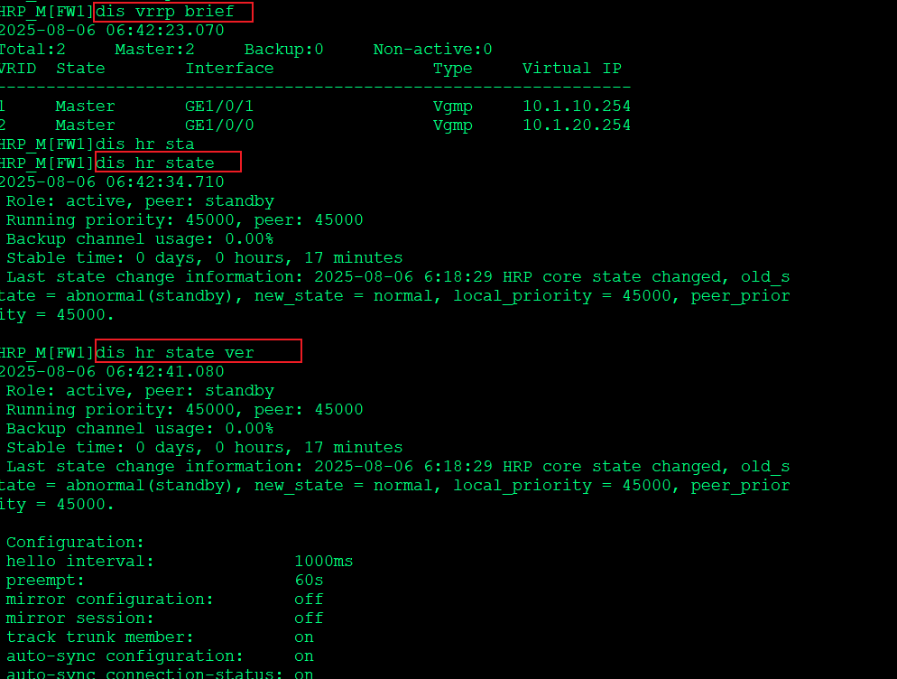
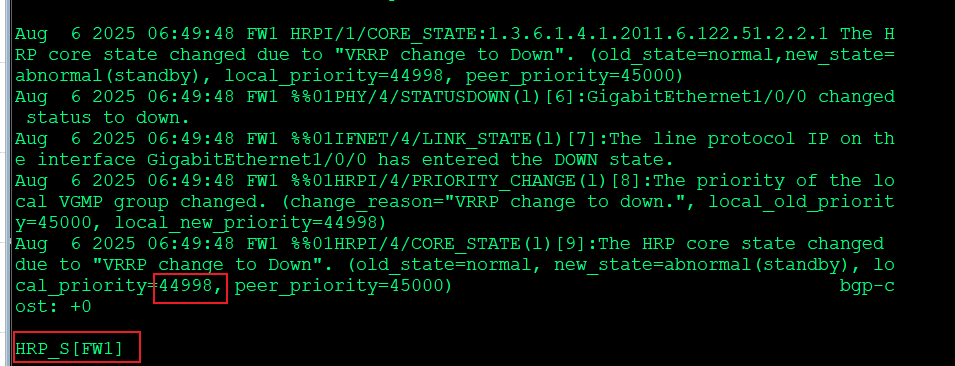
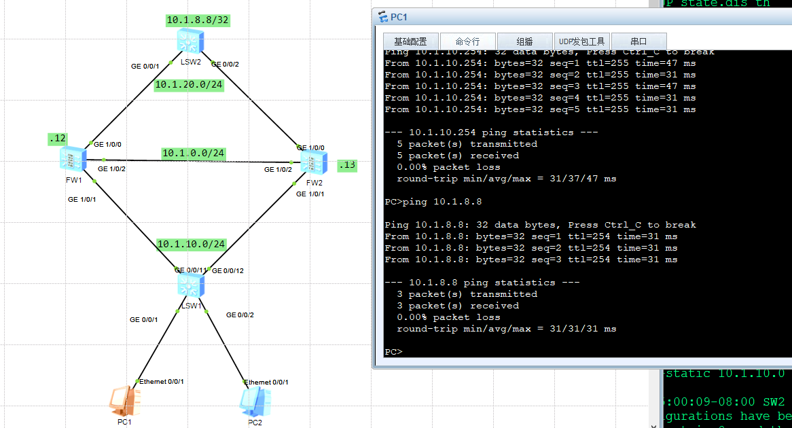
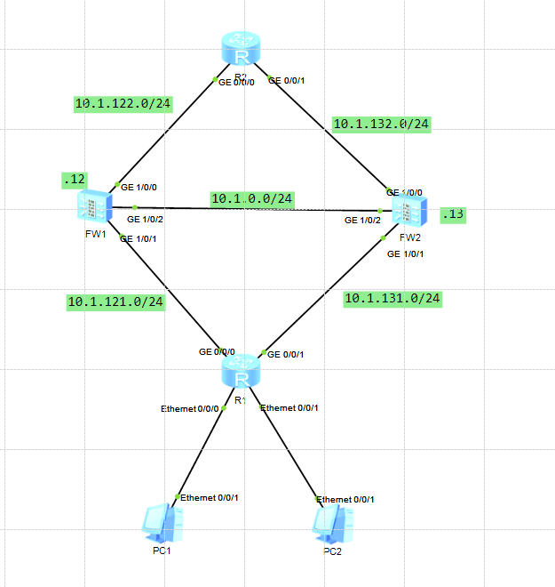
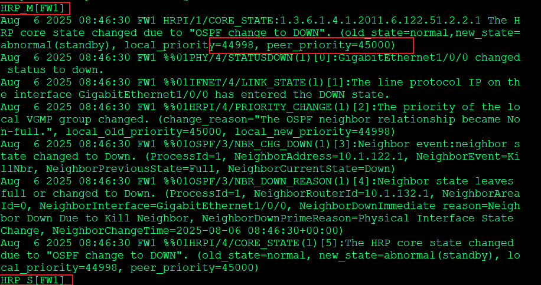
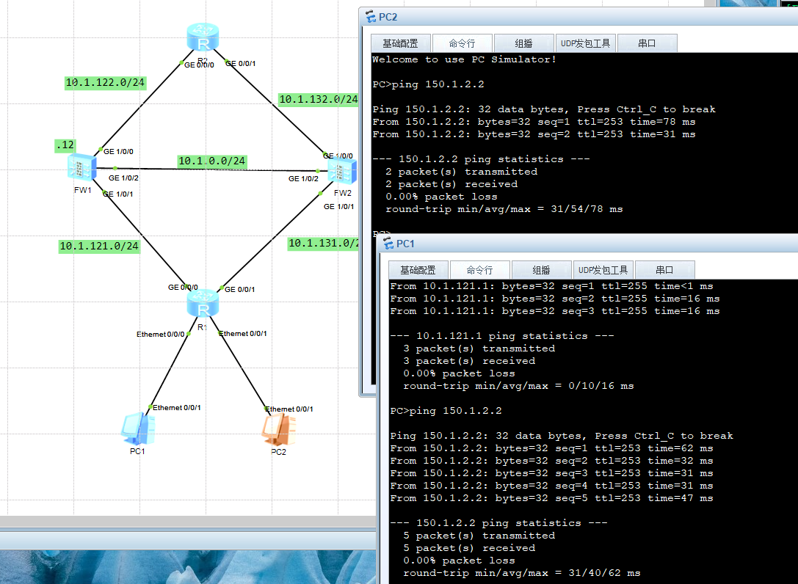

---
# HCIE-防火墙安全
layout: pags
title: 防火墙安全
date: 2025-08-06 15:23:54
tags: Network
categories: 
- [HCIE,5.1防火墙安全]
---

### 长连接

在实际的网络环境中，某些特殊的业务数据流的会话信息需要长时间不被老化。通过配置长连接功能，可以保证此类业务正常运行

背景
- 用户通过FTP下载大文件，需要间隔很长时间才会在控制通道继续发送控制报文。
- 用户需要查询数据库服务器上的数据，这些查询操作的时间间隔远大于TCP的会话老化时间。

配置长连接
1. 在用户视图下执行命令system-view，进入系统视图。
2. 执行命令security-policy，进入安全策略视图。
3. 执行命令rule name rule-name，创建安全策略规则，并进入安全策略规则视图。
4. 执行命令long-link enable，启用长连接功能。
5. 执行命令long-link aging-time interval，配置长连接老化时间。
<!-- more -->
#### 防火墙基础配置实验拓扑



配置

```bash
Telnet
#firewall zone trust
 add interface GigabitEthernet1/0/1
 #
 aaa
 manager-user USER
  password cipher Huawei@123
  service-type telnet ssh
  #
interface GigabitEthernet1/0/1
 undo shutdown
 ip address 10.1.121.12 255.255.255.0
 service-manage ping permit
 service-manage telnet permit
 #
 user-interface vty 0 4
 authentication-mode aaa
 protocol inbound all
 #
 
 SSH
 #
firewall zone untrust
 add interface GigabitEthernet1/0/0
 #
 stelnet server enable
 #
interface GigabitEthernet1/0/0
 undo shutdown
 ip address 155.1.122.12 255.255.255.0
 service-manage ping permit
 service-manage ssh permit
 #
 rsa local-key-pair create 
 #
 ssh authentication-type default password 
 #
 aaa
  manager-user USER
  password cipher @%@%/F/'D{HMpM=pxVJW!Yg(U^1wX%P,W:6RL:.=8W;|Qi37^1zU@%@%
  service-type telnet ssh
  #
  ssh server hmac sha2_256 sha1
  #
   user-interface vty 0 4
 authentication-mode aaa
 protocol inbound all
 #
 
 NAPT
 #
 nat address-group  NAT_POOL 1
 mode pat
 section 1 155.1.122.11 155.1.122.20
 #
nat-policy
 rule name NAPT
  source-zone trust
  destination-zone untrust
  source-address 10.1.1.0 mask 255.255.255.0
  action source-nat address-group NAT_POOL
  #
   rule name IN_To_Untrust
  source-zone trust
  destination-zone untrust
  action permit
  #
  nat server o protocol tcp global 155.1.122.10 www inside 10.1.0.10 www
 nat server 1 protocol tcp global 155.1.122.10 ftp inside 10.1.0.10 ftp
#  配置NAT ALG
firewall zone dmz
 detect ftp
 #
 firewall zone untrust
 detect ftp  
 #
 rule name OUT_TO_DMZ
  source-zone untrust
  destination-zone dmz
  destination-address 10.1.0.10 mask 255.255.255.255
  service protocol tcp destination-port 21
  service protocol tcp destination-port 80
  action permit
  #
```

验证Telnet




验证SSH




### 防火墙双机热备实验

1. 防火墙三层，上下两层

#### 实验拓扑





配置

```bash
FW-1
#
 hrp enable
 hrp interface GigabitEthernet1/0/2 remote 10.1.0.13
 #
interface GigabitEthernet1/0/0
undo shutdown
ip address 10.1.20.12 255.255.255.0
vrrp vrid 2 virtual-ip 10.1.20.254 active
interface GigabitEthernet1/0/1
undo shutdown
ip address 10.1.10.12 255.255.255.0
vrrp vrid 1 virtual-ip 10.1.10.254 active
interface GigabitEthernet1/0/2
undo shutdown
ip address 10.1.0.12 255.255.255.0
#下面配置会自动同步
security-policy
 rule name LOCAL_TO_ANY
  source-zone local
  action permit
 rule name IN_TO_OUT
  source-zone trust
  destination-zone untrust
  action permit
  #
ip route-static 0.0.0.0 0.0.0.0 10.1.20.8
#
FW-2
#
 hrp enable
 hrp interface GigabitEthernet1/0/2 remote 10.1.0.12
 #
 interface GigabitEthernet1/0/0
 undo shutdown
 ip address 10.1.20.13 255.255.255.0
 vrrp vrid 2 virtual-ip 10.1.20.254 standby
#
interface GigabitEthernet1/0/1
 undo shutdown
 ip address 10.1.10.13 255.255.255.0
 vrrp vrid 1 virtual-ip 10.1.10.254 standby
#
interface GigabitEthernet1/0/2
 undo shutdown
 ip address 10.1.0.13 255.255.255.0
 #
 ip route-static 0.0.0.0 0.0.0.0 10.1.20.8
 #
 LSW2
 回程路由
 ip route-static 10.1.10.0 24 10.1.20.254
#
```

验证配置




验证 关掉LSW2交换机0/0/1口 （注：不要关防火墙上的口，配置会通过HRP同步到另一台设备）





验证出网




以上实验防火墙是主备模式        

实现负载分担

```bash
FW-1
#
interface GigabitEthernet1/0/0
 undo shutdown
 ip address 10.1.20.12 255.255.255.0
 vrrp vrid 2 virtual-ip 10.1.20.254 active
 vrrp vrid 4 virtual-ip 10.1.20.253 standby
 service-manage ping permit
#
interface GigabitEthernet1/0/1
 undo shutdown
 ip address 10.1.10.12 255.255.255.0
 vrrp vrid 1 virtual-ip 10.1.10.254 active
 vrrp vrid 3 virtual-ip 10.1.10.253 standby
 service-manage ping permit
#
hrp mirror session enable 
#

FW-2
#
interface GigabitEthernet1/0/0
 undo shutdown
 ip address 10.1.20.13 255.255.255.0
 vrrp vrid 2 virtual-ip 10.1.20.254 standby
 vrrp vrid 4 virtual-ip 10.1.20.253 active
 service-manage ping permit
 #
interface GigabitEthernet1/0/1
 undo shutdown
 ip address 10.1.10.13 255.255.255.0
 vrrp vrid 1 virtual-ip 10.1.10.254 standby
 vrrp vrid 3 virtual-ip 10.1.10.253 active
 service-manage ping permit
 #
 hrp mirror session enable  //快速备份会话信息
#
 LSW2
 回程路由
 ip route-static 10.1.10.0 24 10.1.20.253
 #
 ```

2. 基于动态路由的双机热备（上下三层）

#### 实验拓扑




通过OSPF路径开销决定主备 默认开销一致实现负载分担

```bash
hrp track ospf interface GigabitEthernet1/0/0
```

检测到OSPF变动实现主备变更

验证




验证网络通信




