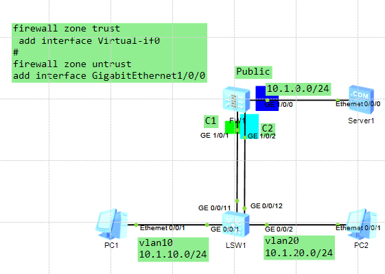
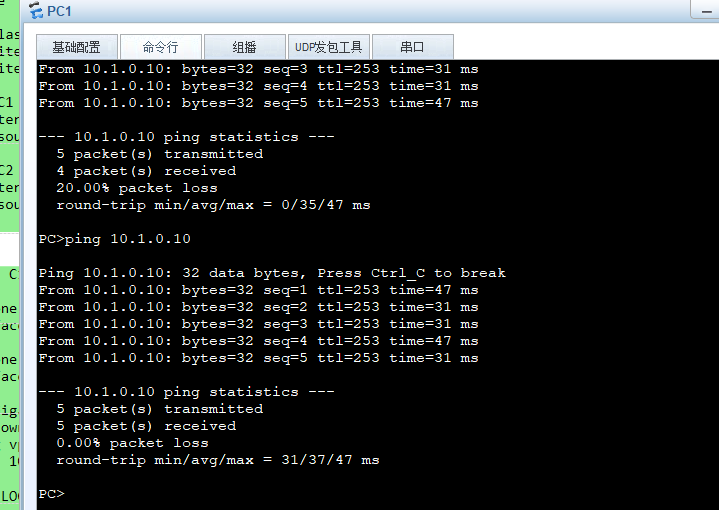
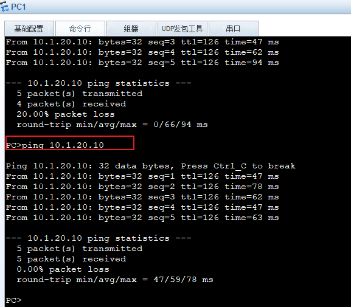
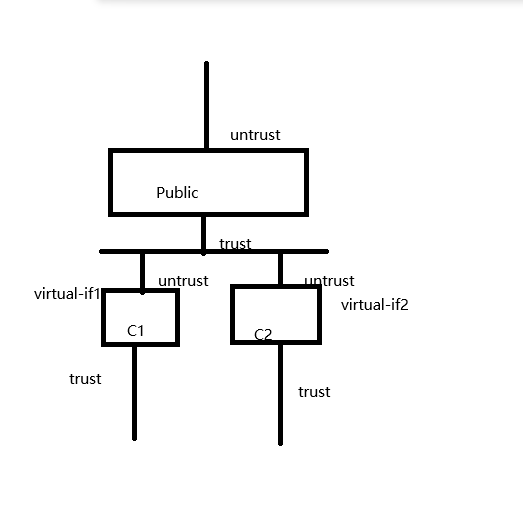

---
# HCIE-防火墙虚拟系统
layout: pags
title: 防火墙虚拟系统
date: 2025-08-07 15:23:54
tags: Network
categories: 
- [HCIE,5.2防火墙虚拟系统]
---

### 虚拟系统

FW上存在两种类型的虚拟系统
- 根系统（public）
  - 根系统是FW上缺省存在的一个特殊的虚拟系统。即使虚拟系统功能未启用，根系统也依然存在。此时，管理员对FW进行配置等同于对根系统进行配置。启用虚拟系统功能后，根系统会继承先前FW上的配置
  - 在虚拟系统这个特性中，根系统的作用是管理其他虚拟系统，并为虚拟系统间的通信提供服务
- 虚拟系统(VSYS)
  - 虚拟系统是在FW上划分出来的、独立运行的逻辑设备
<!-- more -->
为了实现每个虚拟系统的业务都能够做到正确转发、独立管理、相互隔离，FW主要实现了几个方面的虚拟化
- 资源虚拟化：每个虚拟系统都有独享的资源，包括接口、VLAN、策略和会话等。根系统管理员分配给每个虚拟系统，由各个虚拟系统自行管理和使用
- 配置虚拟化：每个虚拟系统都拥有独立的虚拟系统管理员和配置界面，每个虚拟系统管理员只能管理自己所属的虚拟系统
- 安全功能虚拟化：每个虚拟系统都可以配置独立的安全策略及其他安全功能，只有属于该虚拟系统的报文才会受到这些配置的影响

通过以上几个方面的虚拟化，当创建虚拟系统之后，每个虚拟系统的管理员都像在使用一台独占的设备

#### 防火墙虚拟系统实验

实验拓扑



实验配置

```bash
vsys enable  //激活防火墙虚拟化
#
resource-class shiyu  //配置资源类（用于虚拟系统的资源占用）
 resource-item-limit session reserved-number 100 maximum 500
 resource-item-limit bandwidth 5 entire
#
vsys name C1 1 //创建虚拟防火墙并绑定资源类
 assign interface GigabitEthernet1/0/1
 assign resource-class shiyu
#
vsys name C2 1 //创建虚拟防火墙并绑定资源类
 assign interface GigabitEthernet1/0/2
 assign resource-class shiyu
 #
 firewall zone trust
 add interface Virtual-if0
#
firewall zone untrust
add interface GigabitEthernet1/0/0
#
switch vsys C1  //切换到虚拟防火墙
#
FW-1-C1  //该界面配置
#
firewall zone trust
 add interface GigabitEthernet1/0/1
#
firewall zone untrust
 add interface Virtual-if1
#
interface GigabitEthernet1/0/1
 undo shutdown
 ip binding vpn-instance C1
 ip address 10.1.10.12 255.255.255.0
#
 rule name LOCAL_TO_ANY
  source-zone local
  action permit
  #
  switch vsys C2  //切换到虚拟防火墙
#
FW-1-C2
#
firewall zone trust
 add interface GigabitEthernet1/0/2
#
firewall zone untrust
 add interface Virtual-if2
#
interface GigabitEthernet1/0/2
 undo shutdown
 ip binding vpn-instance C2
 ip address 10.1.20.12 255.255.255.0
#
 rule name LOCAL_TO_ANY
  source-zone local
  action permit
  #
 虚拟系统与根系统之间的通信
安全策略配置
C1\Public
#
rule name IN_TO_OUT 
  source-zone trust
  destination-zone untrust
  action permit
根系统配置
ip route-static 10.1.10.0 24 vpn-instance C1
虚拟系统配置
ip route-static 10.1.0.0 255.255.255.0 public
#
虚拟系统之间互通
路由配置（根系统配置）
ip route-static vpn-instance C1 10.1.20.0 255.255.255.0 vpn-instance C2
ip route-static vpn-instance C2 10.1.10.0 255.255.255.0 vpn-instance C1
#
安全策略（C1）
 rule name IN_TO_OUT
  source-zone trust
  destination-zone untrust
  action permit
  #
  安全策略（C2）
 rule name OUT_TO_IN
  source-zone untrust
  destination-zone trust
  action permit
```

验证虚拟系统与根系统之间的通信




验证虚拟系统之间互访




逻辑拓扑图



---------------------------------------------------------------------------------------------------------------------------------


